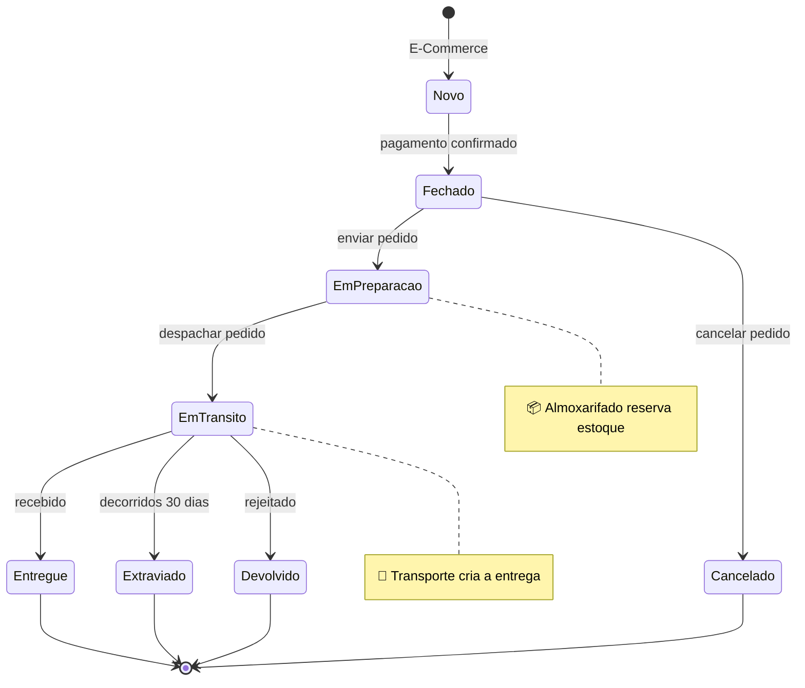
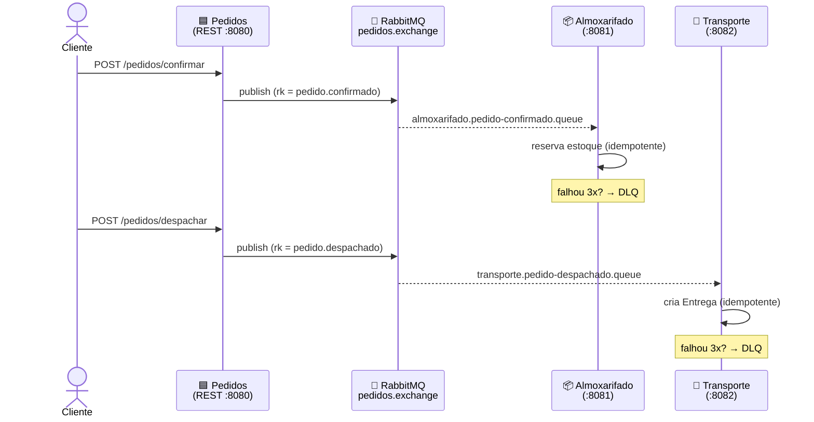
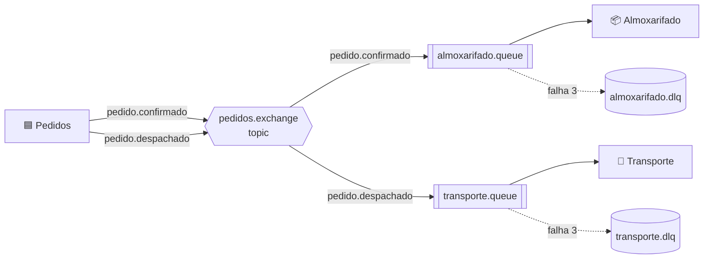

<div align="center">

# 🐾 PetFriends — Microsserviços _event-driven_ com DDD

**Decomposição de um monólito em microsserviços que conversam por eventos de domínio**
_(assíncrono via RabbitMQ), aplicando Domain-Driven Design e padrões de decomposição._

<br>


</div>

---

> [!NOTE]
> O módulo web (`PetFriends_Web`, ReactJS) acessa Clientes, Produtos e Pedidos de forma
> **síncrona** via REST. Já o `PetFriends_Pedidos` notifica `PetFriends_Almoxarifado` e
> `PetFriends_Transporte` de forma **assíncrona, por eventos** — exatamente a seta vermelha
> dos diagramas conceituais.

<div align="center">

### 🚀 Comece em um comando

</div>

```bash
docker compose up --build      # sobe RabbitMQ + os 3 serviços
bash petfriends.sh             # console interativo de demonstração
```

---

## 📚 Sumário

| | Seção | | Seção |
|---|---|---|---|
| 1 | [Contexto](#-contexto) | 7 | [Como executar](#-como-executar) |
| 2 | [Arquitetura](#-arquitetura) | 8 | [Console interativo](#-console-interativo) |
| 3 | [Modelagem DDD](#-modelagem-ddd) | 9 | [Testes e qualidade](#-testes-e-qualidade) |
| 4 | [Domain Events (dissertativas)](#-domain-events--respostas-dissertativas) | 10 | [Roadmap / melhorias futuras](#-roadmap--melhorias-futuras) |
| 5 | [Observabilidade (dissertativas)](#-observabilidade--respostas-dissertativas) | 11 | [Stack técnica](#-stack-técnica) |
| 6 | [Mapa: prova → artefato](#-mapa-questão-da-prova--artefato) | 12 | [Estrutura de pastas](#-estrutura-de-pastas) |

---

## 🧭 Contexto

O sistema modela o ciclo de vida do agregado **Pedido**. O diagrama de estados abaixo é
renderizado direto pelo GitHub (Mermaid):



Dois **bounded contexts** reagem às transições do Pedido:

| Contexto | Responsabilidade | Reage a |
|---|---|---|
| 📦 **PetFriends_Almoxarifado** | Controla estoque; reserva itens quando o pedido entra em preparação | `pedido.confirmado` |
| 🚚 **PetFriends_Transporte** | Gerencia a entrega; cria a remessa quando o pedido é despachado | `pedido.despachado` |

---

## 🏗️ Arquitetura

### Módulos

| Módulo | Papel | Porta |
|---|---|:---:|
| [`petfriends-shared-events`](petfriends-shared-events) | Contratos dos eventos de domínio (biblioteca compartilhada) | — |
| [`petfriends-pedidos`](petfriends-pedidos) | Publica os eventos do agregado Pedido (produtor) | `8080` |
| [`petfriends-almoxarifado`](petfriends-almoxarifado) | Consome `pedido.confirmado` e reserva estoque (`ItemEstoque`) | `8081` |
| [`petfriends-transporte`](petfriends-transporte) | Consome `pedido.despachado` e cria a `Entrega` | `8082` |

### Fluxo _event-driven_ (sequência)



### Topologia AMQP



- **Topologia:** uma `TopicExchange` `pedidos.exchange`; cada consumidor tem **fila própria + Dead Letter Queue (DLQ)** ligada pela sua _routing key_. Mensagens que falham após **3 retentativas** são isoladas na DLQ — nem perdidas, nem reprocessadas para sempre.
- **Serialização:** eventos em JSON (`Jackson2JsonMessageConverter` + `JavaTimeModule`, datas ISO-8601).
- **Entrega _at-least-once_ + idempotência:** ver [Domain Events](#-domain-events--respostas-dissertativas).

---

## 🧩 Modelagem DDD

### Agregados (Aggregate Roots)

| Contexto | Agregado | Invariante protegido | Arquivo |
|---|---|---|---|
| 📦 Almoxarifado | `ItemEstoque` | Nunca reservar/baixar mais do que está disponível | [ItemEstoque.java](petfriends-almoxarifado/src/main/java/com/petfriends/almoxarifado/domain/ItemEstoque.java) |
| 🚚 Transporte | `Entrega` | Transições de estado válidas (Criada→Em Trânsito→Entregue/Extraviada/Devolvida) | [Entrega.java](petfriends-transporte/src/main/java/com/petfriends/transporte/domain/Entrega.java) |

### Value Objects

| VO | Papel | Arquivo |
|---|---|---|
| `Quantidade` | Quantidade não-negativa, imutável | [Quantidade.java](petfriends-almoxarifado/src/main/java/com/petfriends/almoxarifado/domain/Quantidade.java) |
| `SKU` | Identificador de produto com formato validado | [SKU.java](petfriends-almoxarifado/src/main/java/com/petfriends/almoxarifado/domain/SKU.java) |
| `EnderecoEntrega` | Endereço coeso, validado (UF, CEP) | [EnderecoEntrega.java](petfriends-transporte/src/main/java/com/petfriends/transporte/domain/EnderecoEntrega.java) |

### Repositories (portas do domínio)

Cada repository expõe operações apenas sobre o _aggregate root_; a implementação JPA fica na infraestrutura (padrão **Ports & Adapters**).

- [`ItemEstoqueRepository`](petfriends-almoxarifado/src/main/java/com/petfriends/almoxarifado/domain/ItemEstoqueRepository.java) → impl. [ItemEstoqueRepositoryJpa](petfriends-almoxarifado/src/main/java/com/petfriends/almoxarifado/infra/persistence/ItemEstoqueRepositoryJpa.java)
- [`EntregaRepository`](petfriends-transporte/src/main/java/com/petfriends/transporte/domain/EntregaRepository.java) → impl. [EntregaRepositoryJpa](petfriends-transporte/src/main/java/com/petfriends/transporte/infra/persistence/EntregaRepositoryJpa.java)

<details>
<summary><b>🔍 Detalhes de implementação (clique para expandir)</b></summary>

<br>

- **Factory de reconstituição** — o agregado `Entrega` expõe `Entrega.reconstituir(...)`, usado pelo repositório ao ler do banco. Reidrata o estado persistido (incl. `status`) sem disparar regras de transição e sem reflexão.
- **Fonte única de roteamento** — os nomes de exchange e routing keys ficam em [`EventRouting`](petfriends-shared-events/src/main/java/com/petfriends/shared/events/EventRouting.java) (módulo de contrato). Configs e testes referenciam essas constantes, evitando strings mágicas duplicadas (um typo viraria erro de compilação, não bug silencioso).
- **Database per service** — cada microsserviço tem seu próprio banco H2 e suas próprias migrations Flyway; não há banco compartilhado.

</details>

---

## ✉️ Domain Events — respostas dissertativas

<details open>
<summary><b>2.1 — Qual funcionalidade síncrona do cliente é afetada pelos eventos?</b></summary>

<br>

A **consulta de disponibilidade/estoque do produto** (o `PetFriends_Web` lendo de `PetFriends_Produtos`/estoque de forma síncrona via REST).

A reserva e a baixa de estoque acontecem de forma **assíncrona**: ao confirmar o pedido, `PetFriends_Pedidos` emite um evento que o `PetFriends_Almoxarifado` consome para reservar o estoque. Logo, a quantidade disponível que o cliente vê é **eventualmente consistente** — entre a confirmação e o processamento do evento, a leitura síncrona pode mostrar um valor desatualizado (ex.: produto ainda "disponível" que já foi todo reservado).

</details>

<details>
<summary><b>2.2 — Enviar só o ID do agregado × enviar o payload completo</b></summary>

<br>

| | Só o ID (_thin event_) | Payload completo (_event-carried state transfer_) |
|---|---|---|
| Acoplamento | Maior — consumidor faz **callback síncrono** ao produtor | Menor — consumidor é **autônomo** |
| Disponibilidade | Depende do produtor estar no ar | Funciona mesmo se o produtor estiver fora |
| Frescor dos dados | Sempre frescos (lidos na hora) | Risco de dados **defasados**; exige versionamento |
| Tamanho / duplicação | Mensagem pequena, sem duplicação | Mensagem maior, **duplica** dados |

Em resumo: **só ID** favorece consistência ao custo de acoplamento e mais chamadas; **payload completo** favorece autonomia e desacoplamento ao custo de duplicação e dados potencialmente defasados.

</details>

<details>
<summary><b>2.3 — Evento Pedidos → Almoxarifado</b></summary>

<br>

O Almoxarifado precisa **reservar estoque por item**. Para evitar callback síncrono ao Pedidos (que reintroduziria acoplamento), o evento carrega **payload completo** com os itens (SKU + quantidade) — ver [PedidoConfirmadoEvent.java](petfriends-shared-events/src/main/java/com/petfriends/shared/events/PedidoConfirmadoEvent.java):

```json
{
  "eventId": "…", "pedidoId": "…", "ocorridoEm": "2026-06-23T10:00:00Z",
  "itens": [ { "sku": "RACAO-001", "quantidade": 2 } ]
}
```

</details>

<details>
<summary><b>2.4 — Evento Pedidos → Transporte</b></summary>

<br>

O Transporte precisa **criar a entrega** com o endereço de destino. Novamente payload completo, para montar a `Entrega` sem callback — ver [PedidoDespachadoEvent.java](petfriends-shared-events/src/main/java/com/petfriends/shared/events/PedidoDespachadoEvent.java):

```json
{
  "eventId": "…", "pedidoId": "…", "clienteId": "…", "ocorridoEm": "2026-06-23T11:00:00Z",
  "endereco": { "logradouro": "…", "cidade": "São Paulo", "uf": "SP", "cep": "01000-000" }
}
```

</details>

> [!IMPORTANT]
> **Idempotência (entrega _at-least-once_).** Todos os eventos carregam `eventId` e `ocorridoEm`.
> O `eventId` garante que uma **reentrega** da mesma mensagem não produza efeito colateral duplicado:
> - 🚚 **Transporte** descarta a criação se já existe `Entrega` para o `pedidoId`.
> - 📦 **Almoxarifado** registra os `eventId` já processados na tabela **`evento_processado`**, gravada na **mesma transação** da reserva (ou tudo commita, ou nada). A PK em `event_id` ainda barra duplicatas concorrentes no commit. → ver [PedidoConfirmadoListener.java](petfriends-almoxarifado/src/main/java/com/petfriends/almoxarifado/application/PedidoConfirmadoListener.java)

---

## 🔭 Observabilidade — respostas dissertativas

> Testes e observabilidade em microsserviços com **Zipkin**, **Micrometer** e **ELK Stack**.

<details>
<summary><b>O.1 — API Gateway: o que é, vantagens e desvantagens</b></summary>

<br>

É um **ponto único de entrada** na frente dos microsserviços. O cliente fala só com o gateway, que **roteia** cada requisição para o serviço certo e concentra preocupações transversais: roteamento, autenticação/autorização, _rate limiting_, _SSL termination_, agregação de respostas, injeção do **ID de correlação** e cache.

| Vantagens | Desvantagens |
|---|---|
| Esconde a topologia interna | **Ponto único de falha** / gargalo — exige alta disponibilidade |
| Centraliza segurança, _throttling_ e _logging_ | Mais um componente para implantar e operar |
| Permite evoluir serviços por trás sem quebrar o cliente | Risco de virar "monólito de roteamento" |

> Exemplos: Spring Cloud Gateway, Kong, NGINX, AWS API Gateway.

</details>

<details>
<summary><b>O.2 — ID de Correlação e seus pré-requisitos</b></summary>

<br>

É um **identificador único gerado por requisição** e **propagado por todos os serviços** envolvidos. Com ele, juntam-se logs/traces espalhados e reconstrói-se a jornada de uma requisição. No PetFriends, viajaria de `Pedidos` → evento → `Almoxarifado`.

**Pré-requisitos:**
- **Geração na borda** — criado no ponto de entrada (normalmente o API Gateway).
- **Propagação** — em HTTP via header (`X-Correlation-Id` / `traceparent`) e em **mensageria via header da mensagem** (AMQP), não só REST.
- **Registro** — incluído em **todo log** (ex.: MDC do SLF4J) e nos _spans_ de tracing.
- **Padronização** — mesmo nome de header/campo entre todos os serviços.

</details>

<details>
<summary><b>O.3 — Micrometer e sua relação com o Zipkin</b></summary>

<br>

**Micrometer** é a biblioteca de **instrumentação/telemetria** do ecossistema Spring — uma _facade_ (assim como o SLF4J é para logs). Coleta **métricas** e, com o **Micrometer Tracing**, gera **traces distribuídos** (spans) de forma agnóstica ao backend.

O **Zipkin** **armazena e visualiza** esses traces. O Micrometer instrumenta e exporta os spans para o Zipkin:

```
Micrometer (gera/propaga spans) ──exporta──▶ Zipkin (coleta, armazena e mostra a timeline)
```

São complementares: o Micrometer **produz**; o Zipkin **recebe e exibe**.

</details>

<details>
<summary><b>O.4 — Agregador de Logs (ELK), vantagens e desvantagens</b></summary>

<br>

Sistema que **coleta, centraliza, indexa e permite pesquisar** os logs de **todos** os microsserviços. Exemplo clássico: **ELK Stack** — **E**lasticsearch (armazena/indexa) · **L**ogstash (coleta/transforma) · **K**ibana (visualização).

| Vantagens | Desvantagens |
|---|---|
| Visão unificada; com o ID de correlação reconstrói-se a jornada | **Custo de infra** (Elasticsearch consome CPU/memória/disco) |
| Diagnóstico muito mais rápido | Complexidade operacional |
| Dashboards, alertas e retenção centralizados | Risco de exposição de **dados sensíveis** se não filtrados |

> **Os três pilares juntos:** o **Gateway** injeta o **ID de correlação** → o **Micrometer** propaga esse ID nos traces para o **Zipkin** (o _como_ a requisição fluiu) → o **ELK** guarda os logs marcados com o mesmo ID (o _o quê_ aconteceu). Tracing e logs amarrados pelo mesmo identificador.

</details>

---

## 🗺️ Mapa: questão da prova → artefato

| Questão | Entregável | Arquivo |
|---|---|---|
| **DDD** — Entity + Repository (Almoxarifado) | `ItemEstoque` + repositório | [ItemEstoque.java](petfriends-almoxarifado/src/main/java/com/petfriends/almoxarifado/domain/ItemEstoque.java), [ItemEstoqueRepository.java](petfriends-almoxarifado/src/main/java/com/petfriends/almoxarifado/domain/ItemEstoqueRepository.java) |
| **DDD** — Value Object (Almoxarifado) | `Quantidade` / `SKU` | [Quantidade.java](petfriends-almoxarifado/src/main/java/com/petfriends/almoxarifado/domain/Quantidade.java), [SKU.java](petfriends-almoxarifado/src/main/java/com/petfriends/almoxarifado/domain/SKU.java) |
| **DDD** — Entity + Repository (Transporte) | `Entrega` + repositório | [Entrega.java](petfriends-transporte/src/main/java/com/petfriends/transporte/domain/Entrega.java), [EntregaRepository.java](petfriends-transporte/src/main/java/com/petfriends/transporte/domain/EntregaRepository.java) |
| **DDD** — Value Object (Transporte) | `EnderecoEntrega` | [EnderecoEntrega.java](petfriends-transporte/src/main/java/com/petfriends/transporte/domain/EnderecoEntrega.java) |
| **Eventos 2.1–2.2** | Respostas dissertativas | [seção acima](#-domain-events--respostas-dissertativas) |
| **Eventos 2.3** | Evento p/ Almoxarifado | [PedidoConfirmadoEvent.java](petfriends-shared-events/src/main/java/com/petfriends/shared/events/PedidoConfirmadoEvent.java) |
| **Eventos 2.4** | Evento p/ Transporte | [PedidoDespachadoEvent.java](petfriends-shared-events/src/main/java/com/petfriends/shared/events/PedidoDespachadoEvent.java) |
| **Async 3.1** — Config mensageria (Almoxarifado) | Exchange + fila + binding + DLQ | [AlmoxarifadoMessagingConfig.java](petfriends-almoxarifado/src/main/java/com/petfriends/almoxarifado/config/AlmoxarifadoMessagingConfig.java) |
| **Async 3.2** — Listener (Almoxarifado) | `@RabbitListener` que reserva estoque (idempotente) | [PedidoConfirmadoListener.java](petfriends-almoxarifado/src/main/java/com/petfriends/almoxarifado/application/PedidoConfirmadoListener.java) |
| **Async 3.3** — Config mensageria (Transporte) | Exchange + fila + binding + DLQ | [TransporteMessagingConfig.java](petfriends-transporte/src/main/java/com/petfriends/transporte/config/TransporteMessagingConfig.java) |
| **Async 3.4** — Listener (Transporte) | `@RabbitListener` que cria a entrega (idempotente) | [PedidoDespachadoListener.java](petfriends-transporte/src/main/java/com/petfriends/transporte/application/PedidoDespachadoListener.java) |
| **Observabilidade O.1–O.4** | Respostas dissertativas | [seção](#-observabilidade--respostas-dissertativas) |

---

## ▶️ Como executar

### Opção A — Docker (um comando)

```bash
docker compose up --build
```

Sobe RabbitMQ + os 3 serviços; espera o broker ficar saudável (healthcheck) antes de iniciar os consumidores; persiste o H2 em volumes nomeados. Painel do RabbitMQ em http://localhost:15672 (guest/guest).

> [!WARNING]
> **Mudou o schema/migrations?** Suba com volumes limpos, senão o Flyway encontra tabelas
> antigas e aborta (`Found non-empty schema but no schema history table`):
> ```bash
> docker compose down -v && docker compose up --build
> ```

### Opção B — Maven (desenvolvimento)

```bash
docker compose up -d rabbitmq          # só o broker
mvn clean install                      # compila e instala os módulos

# em três terminais:
mvn -pl petfriends-almoxarifado spring-boot:run
mvn -pl petfriends-transporte  spring-boot:run
mvn -pl petfriends-pedidos     spring-boot:run
```

### Testando o fluxo via `curl`

```bash
# 1) Confirmar pedido → Almoxarifado reserva estoque (SKU RACAO-001 já vem semeado)
curl -X POST http://localhost:8080/pedidos/confirmar \
  -H "Content-Type: application/json" \
  -d '{"eventId":"11111111-1111-1111-1111-111111111111",
       "pedidoId":"22222222-2222-2222-2222-222222222222",
       "ocorridoEm":"2026-06-23T10:00:00Z",
       "itens":[{"sku":"RACAO-001","quantidade":2}]}'

# 2) Despachar pedido → Transporte cria a entrega
curl -X POST http://localhost:8080/pedidos/despachar \
  -H "Content-Type: application/json" \
  -d '{"eventId":"33333333-3333-3333-3333-333333333333",
       "pedidoId":"22222222-2222-2222-2222-222222222222",
       "clienteId":"44444444-4444-4444-4444-444444444444",
       "ocorridoEm":"2026-06-23T11:00:00Z",
       "endereco":{"logradouro":"Rua das Flores","numero":"100","complemento":"Apto 12",
                   "bairro":"Centro","cidade":"Sao Paulo","uf":"SP","cep":"01000-000"}}'

# 3) Consultar resultado
curl http://localhost:8081/estoque        # estoque do Almoxarifado
curl http://localhost:8082/entregas       # entregas do Transporte
```

> 💡 **Dica de apresentação:** reenvie o **mesmo** comando de confirmar (mesmo `eventId`) e
> mostre que o estoque **não** desconta de novo — é a idempotência em ação.

---

## 🖥️ Console interativo

Para demonstração ao vivo, há um menu de terminal que dispara os eventos e mostra o resultado:

```bash
bash petfriends.sh
```

```
1) Confirmar pedido   → reserva estoque e mostra o saldo atualizado
2) Despachar pedido   → cria a entrega (reaproveita o último pedido)
3) Ver estoque        4) Ver entregas        5) Ver filas (RabbitMQ)
6) Testar DLQ (SKU inexistente)              s) Status dos serviços
```

---

## ✅ Testes e qualidade

```bash
mvn test      # testes unitários (agregados e Value Objects)
mvn verify    # unitários + integração (RabbitMQ real via Testcontainers)
```

- **Unitários:** invariantes do `ItemEstoque` (reserva nunca excede o disponível), máquina de estados da `Entrega`, validações de `Quantidade`, `SKU` e `EnderecoEntrega`.
- **Integração (Testcontainers):** publicam um evento em um RabbitMQ **real** e verificam a reserva de estoque / criação da entrega ponta a ponta — incl. um teste que **reenvia o mesmo evento** e prova a idempotência ([PedidoConfirmadoListenerIT](petfriends-almoxarifado/src/test/java/com/petfriends/almoxarifado/PedidoConfirmadoListenerIT.java), [PedidoDespachadoListenerIT](petfriends-transporte/src/test/java/com/petfriends/transporte/PedidoDespachadoListenerIT.java)). Pulam automaticamente onde o Docker não estiver acessível (`disabledWithoutDocker`).
- **Schema versionado com Flyway:** o schema é criado por migrations e o Hibernate roda em modo `validate` (não altera o banco):
  - Almoxarifado: [V1 — item_estoque](petfriends-almoxarifado/src/main/resources/db/migration/V1__create_item_estoque.sql), [V2 — evento_processado](petfriends-almoxarifado/src/main/resources/db/migration/V2__create_evento_processado.sql)
  - Transporte: [V1 — entrega](petfriends-transporte/src/main/resources/db/migration/V1__create_entrega.sql)

---

## 🛣️ Roadmap / melhorias futuras

Itens conscientemente fora do escopo atual, registrados como evolução natural do projeto:

| Prioridade | Melhoria | Por quê |
|:---:|---|---|
| 🔴 Alta | **Trava otimista (`@Version`)** no `ItemEstoque` | Evitar _lost update_ quando houver **múltiplas instâncias** do Almoxarifado competindo na mesma fila (reservas concorrentes do mesmo SKU). |
| 🟠 Média | **DTOs de leitura** nos endpoints de consulta | Hoje os controllers expõem entidades JPA; DTOs desacoplam o contrato HTTP do schema. |
| 🟠 Média | **Erros de negócio direto para a DLQ** | `EstoqueInsuficiente`/`ItemNaoEncontrado` nunca terão sucesso ao reprocessar — marcá-los como não-recuperáveis evita 3 retentativas inúteis. |
| 🟡 Baixa | **Observabilidade real** (Micrometer + Zipkin + ELK) | Sair da teoria (seção O) para a prática: ID de correlação propagado em REST **e** AMQP. |
| 🟡 Baixa | **Banco de produção** (PostgreSQL) + perfis | H2 é ótimo para demo; produção pediria um banco gerenciado e `application-prod.yml` sem H2 console / `show-sql`. |
| 🟡 Baixa | **API Gateway** (Spring Cloud Gateway) | Ponto único de entrada, segurança e _rate limiting_ centralizados. |

---

## 🧰 Stack técnica

- **Java 17**, **Spring Boot 3.2** (Web, AMQP, Data JPA)
- **RabbitMQ** (mensageria assíncrona, topic exchange + DLQ)
- **H2** (banco por serviço — _database per service_), **Flyway** (migrations)
- **Maven** multi-módulo · **Docker / Docker Compose**
- **JUnit 5 + AssertJ + Testcontainers** (testes)

---

## 📂 Estrutura de pastas

```
PETFRIEND/
├── pom.xml                       # POM pai (módulos + Failsafe)
├── docker-compose.yml            # broker + 3 serviços
├── Dockerfile                    # multi-stage parametrizado por MODULE
├── petfriends.sh                 # console interativo de demonstração
├── petfriends-shared-events/     # contratos dos eventos de domínio
├── petfriends-pedidos/           # produtor (REST + publisher)
├── petfriends-almoxarifado/      # domain · infra · config · application · api
└── petfriends-transporte/        # domain · infra · config · application · api
```

> Cada serviço de negócio segue a separação **domain** (agregados, VOs, repositórios) · **infra** (persistência JPA) · **config** (mensageria) · **application** (listeners) · **api** (REST de consulta).

<div align="center">
<br>

_Projeto acadêmico — decomposição DDD em microsserviços event-driven._ 🐾

</div>
